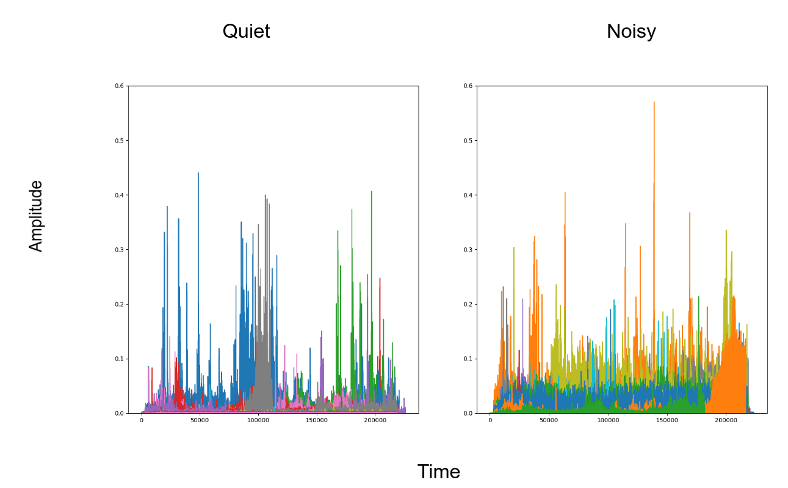
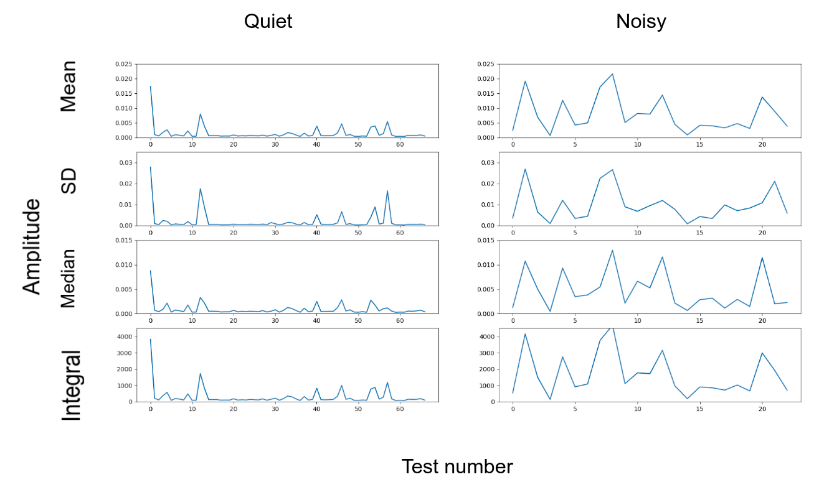
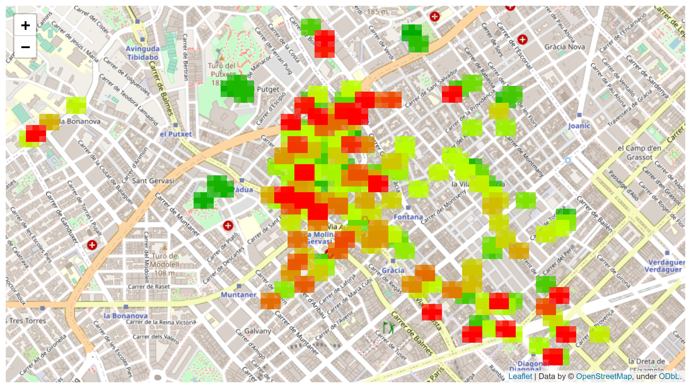

# Noise Mapper

This repository contains the different parts to register sound with a mobile phone in different locations and show it
on a map.

## Architecture

### Android

The [Android](android) directory contains the Python code that records audio samples and the location of the phone, and 
publishes the data to an MQTT broker. Then, the program goes to sleep for a configurable amount of time. 

In order to run the Python code on Android, the 
[QPython 3L](https://play.google.com/store/apps/details?id=org.qpython.qpy) app can be used. The code depends on the 
[androidhelper](https://kylelk.github.io/html-examples/androidhelper.html) library, which is a deprecated project, and 
poses several challenges, like being able to request updated location information, running in background, and maintaining 
an active connection with the broker. 

### Consumer

Docker service with basic code in Python that consumes from the broker upon reception of new messages, processes the 
information and inserts it in the database. The processing is very basic, and consists in reading the coordinates and 
the audio file, converting the audio file into an array of samples and extracting its mean amplitude value (used as a 
measure of "amount of noise"), and inserting it together with the location where the sample was recorded, as well as 
other metadata like the user ID and the user's session ID. 

### API

Docker service with an API implemented in Flask that delivers to the user a color-coded visualization of the noise in 
every sampled location. The service uses the [folium](https://github.com/python-visualization/folium) library to show 
the data on the map.

The whole folium package is included as part of this repository, since the version being used is a fork from the original 
version. The motivation for the fork is to allow showing on the map single channel data (the only dimension for every 
pixel is the 1D "noise" magnitude), while also having an alpha-channel to configure transparency. 

### Others

* Message broker: MQTT protocol is used
* Database: InfluxDB was chosen for simplicity. It should be replaced by a more GIS-oriented DB like Postgres + PostGIS
* Metrics: some metrics are being recorded in the DB too, and can be visualized in a Grafana dashbaord that is also 
included

## Installation

SSH into the server and clone the repository. There is a [Makefile](Makefile) in the top directory that allows setting up the 
environment and running all the required services. The only service not included is the MQTT broker, for which I used 
[CloudAMQP](https://www.cloudamqp.com/). The [docker-compose](docker-compose.yml) can be modified to include an MQTT 
broker. 

There is a .env.template file in both the android and the consumer folders, that must be copied into a .env file and 
set there the MQTT connection credentials. 

## Calibration

I recorded several samples in locations that I considered noisy (big streets, construction works, ...) and quiet areas 
(parks, pedestrian areas, ...). I took 60+ samples in quiet areas and 20+ in noisy areas. In the next picture, every 
colour represents one recording of 5 seconds of duration.

For each, I computed different statistics in order to choose the ones that qualitatively 
showed the biggest difference between "quiet" and "noisy". The conclusion was that all the statistics I checked showed 
similar results, and so I chose to use "mean()"

I also used this step to select the dynamic range I wanted to use. Based on the calibration data, I selected `0.02` as 
the upper bound for the mean value, meaning that samples with higher mean values would be still mapped to `0.02`. This 
is to prevent having peaks that would distort the overall visualization. 

## Tests 

After that, I did many walks around Barcelona with the Android script running, and the resulting map looks like this:
)

I used a Jet colormap to color code noise intensity, where green represents quiet, yellow mid-noisy and red very noisy. 

Every sampled point is represented as a rectangle on the sampling location, and an attempt to propagate the value on 
neighbouring pixels by making them have the same colour, but more transparent. 

# TODO
* Consumer
    * Apply noise classification using ML, label the data (cars, people talking, baby, music, ...) and be able to 
    visualize the locations where every class is more frequent
* API
    * Create real API endpoints returning data in GeoJSON format. Then create MAP endpoints that call the API ones
    * Create admin view and permission management (Django?)
    * Make code generic for any latitude, longitude (currently only works in a box around Barcelona city)
    * Support params to URL (filter by GNSS data only, or by new data only, or ...)
* FE
    * Add form to select min/max noise, hour of the day, day of the week, user, ...
    * Add Grafana iframes to main site
    * Create side by side comparison of noisy and quiet heatmaps
    * Make sound pixels semi-transparent to show some background
    * Improve averging between neighbouring pixels (now max wins all)
    * Use hexagons instead of rectangles for visualization
* Android
    * Bundle the code into an APK (use Kivy?)
    * Write android logs to file too
    * Given the issues with keeping the MQTT connection, send the data via api instead
    * Send location data and audio file in same message to the MQTT broker (codify the pos in a binary stream?)
* Infrastructure
    * Start own MQTT broker instead of CloudAMQP
    * Add CI/CD to auto-deploy in GCP
    * Add infra monitoring (allow checking from Grafana number of running docker containers, time since last restart, 
    Rabbit queue size, etc)
    * Replace Influx by PostgreSQL + PostGIS
* Others
    * Create domain name
    * Generate timelapse of map evolution
    * Create PR to Folium with change and import that branch version
    * Unit testing
    * Upgrade Python version being used
    * Filter out some noises, e.g crying baby sound (or alternatively consider only cars noise)
    * Compare results with Barcelona open data 

## References

* A project that estimated noise pollution based on OSM labels (streed width, etc): http://lukasmartinelli.ch/gis/2016/04/03/openstreetmap-noise-pollution-map.html 
* An Android APP in Kotlin that sends the phone location to an MQTT broker: https://owntracks.org/ 